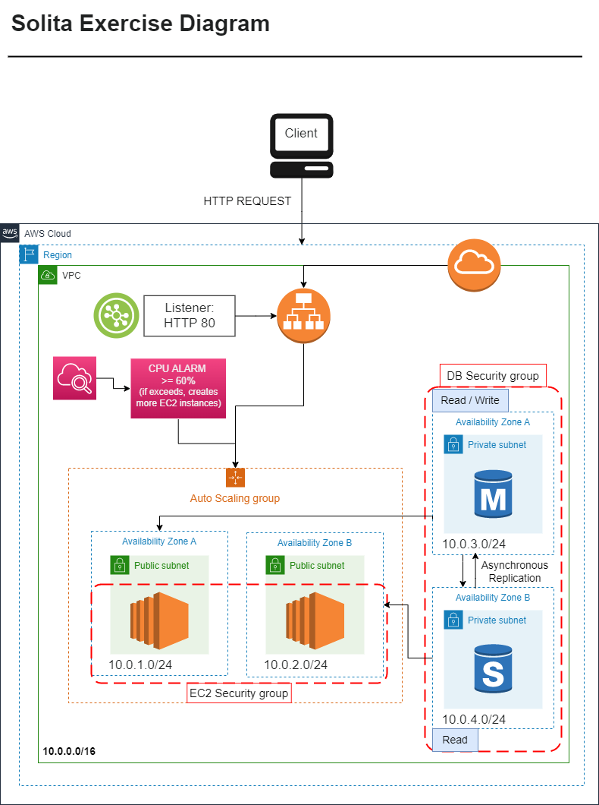

# terraform-aws-solita-exercise



Application load balancer has a target group which has a health check. If the health check fails it drains the instances and initializes new instances.

**Note**: When running this project, it takes some time to complete the apply. The database has `multi_az` on.

I used some variables, but didn't add variables for absolutely everything you could add an variable for.

This is the sample `terraform.tfvars` file:

```
name                           = ""
application                    = ""

region                         = ""
vpc_cidr_block                 = ""
pub_subnet_cidr_block          = []
priv_subnet_cidr_block         = []

ssh_sg_cidr_block              = []

ami                            = ""
instance_type                  = ""

engine                         = ""
engine_version                 = ""
instance_class                 = ""
parameter_group_name           = ""

asg_max_size                   =
asg_min_size                   =
asg_desired_capacity           =
health_check_interval          =
health_check_healthy_threshold =
db_allocated_storage           =
```

If you want to just get this running, you can use the values I use.

Here are my values:

```
name                           = "solita_exercise"
application                    = "flask_hello_world_application"

region                         = "eu-north-1"
vpc_cidr_block                 = "10.0.0.0/16"
pub_subnet_cidr_block          = ["10.0.1.0/24", "10.0.2.0/24"]
priv_subnet_cidr_block         = ["10.0.3.0/24", "10.0.4.0/24"]

# This is very bad
# You should use a specific IP or range of IPs
# A VPN for example

# I used it just for this project, but would never use it in the real-world
ssh_sg_cidr_block              = ["0.0.0.0/0"]

ami                            = "ami-00dff27dd99d89d89"
instance_type                  = "t3.micro"

engine                         = "mysql"
engine_version                 = "8.0"
instance_class                 = "db.t3.micro"
parameter_group_name           = "default.mysql8.0"

asg_max_size                   = 4
asg_min_size                   = 2
asg_desired_capacity           = 2
health_check_interval          = 10
health_check_healthy_threshold = 2
db_allocated_storage           = 10
```

Initialize:

```
terraform init
```

Plan:

```
terraform plan
```

Apply:

```
terraform apply
```

Destroy:

```
terraform destroy
```

**Important notes**:

> Since this task's environment is not meant to be left on. There are things I would've done differently if it was meant to be. I also have other things I would add as well.

- I would create a new user for the database, grant permission to write and read and use the new user to run the script. Using the database as root is a bad.
- I would use a secret manager for the database credentials if the database was going to be kept up and not destroyed. Adding secret manager is more of a manual process.
- I would regularly make backups of the DB.
- I would create a DNS for the DB, because the underlying IP address changes during failover.
- I would monitor and log.
- I would use HTTPS, but in this case I used HTTP, because I'd need a certificate.
- I could use a NAT Gateway and private subnets instead of creating public subnets for ec2 instances. That would be costly though.
- I would use a API Gateway if I had more regions to use.
